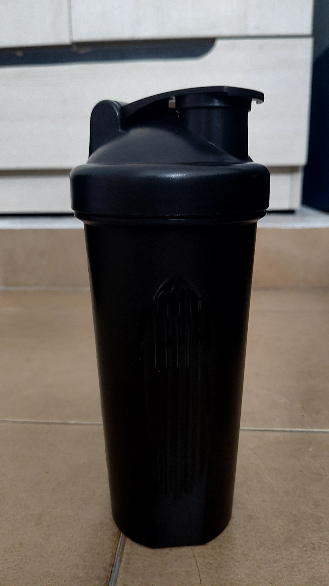
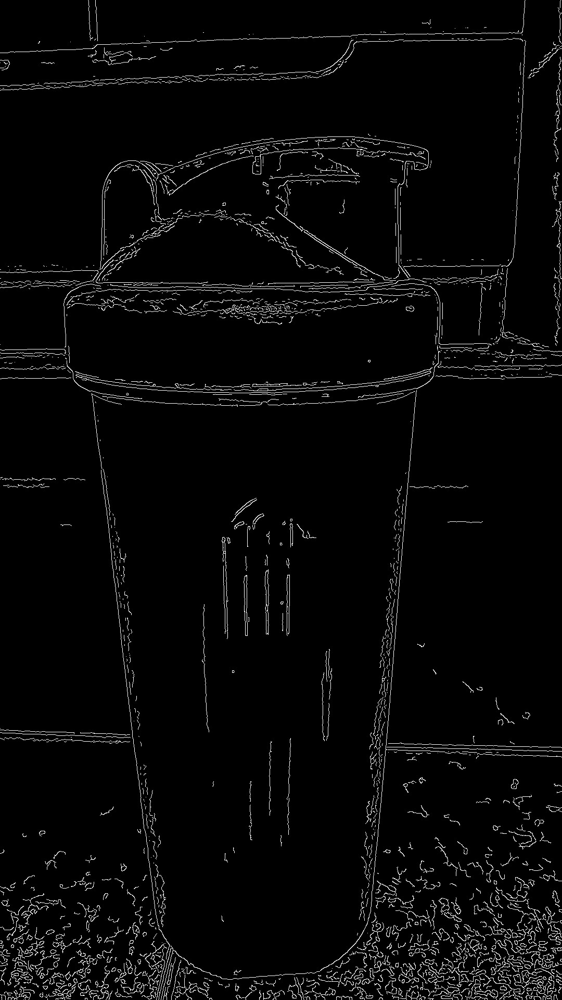
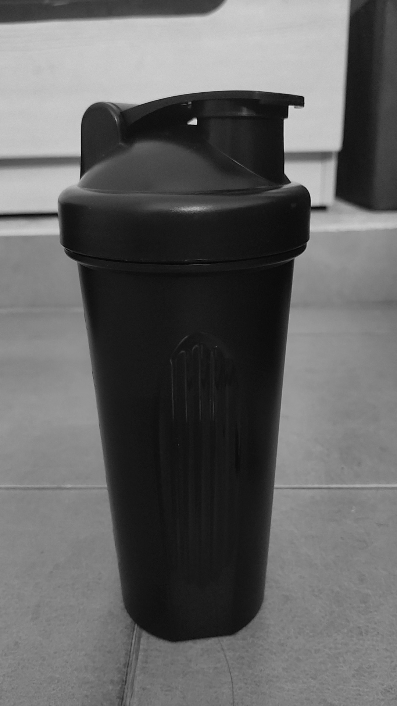
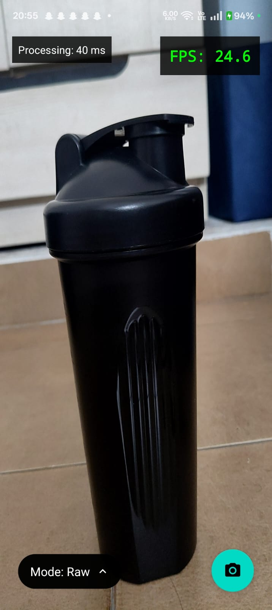
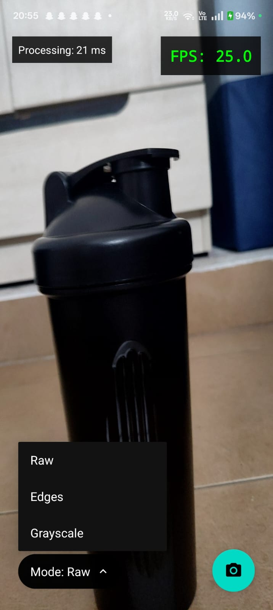
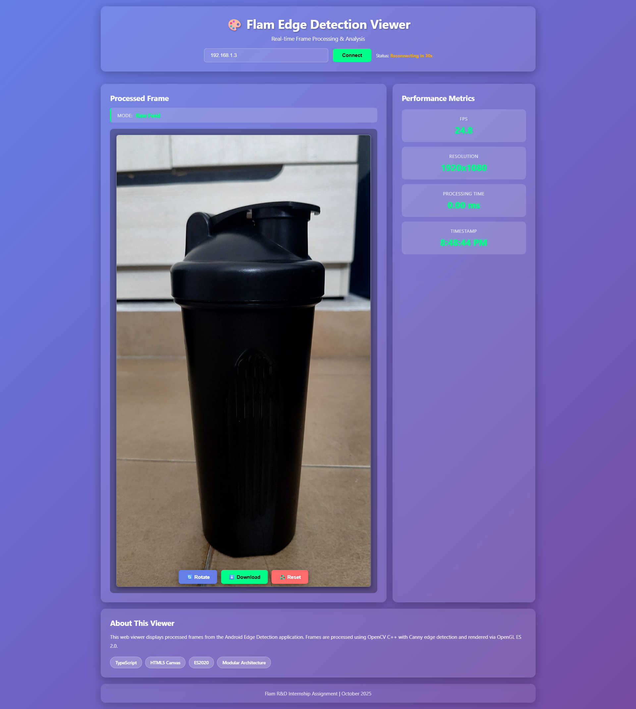
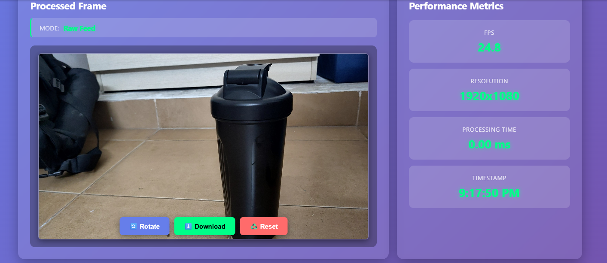

# 📱 Flam Edge Detection Viewer

Real-time edge detection Android app using OpenCV C++ (via JNI), OpenGL ES rendering, and TypeScript web viewer.

**Assignment:** Flam R&D Internship Technical Assessment
**Duration:** 3 Days (October 6-9, 2025)
**Submission:** October 9, 2025

---

## 🎬 Demo


*Real-time Canny edge detection with WebSocket streaming to web viewer*

---

## ✨ Features

### Android Application

- ✅ **Camera Integration**: Real-time capture using Camera2 API with ImageReader
- ✅ **Native Processing**: OpenCV C++ via JNI for optimal performance
- ✅ **Edge Detection**: Canny algorithm with Gaussian blur preprocessing
- ✅ **OpenGL Rendering**: Hardware-accelerated display with GLSL shaders
- ✅ **Multiple Modes**: Toggle between raw, edges, and grayscale
- ✅ **Performance Metrics**: Real-time FPS counter and detailed timing breakdown
- ✅ **Frame Export**: Save processed frames to gallery (PNG format)
- ✅ **WebSocket Server**: Real-time streaming to web viewer (Ktor server)
- ✅ **Device Orientation**: Automatic landscape/portrait detection
- ✅ **Freeze & Capture**: Pause live feed, export on-demand

### Web Viewer

- ✅ **TypeScript**: Strongly-typed, modular ES2020 architecture
- ✅ **HTML5 Canvas**: High-performance frame rendering with rotation
- ✅ **Real-time Stats**: FPS, resolution, processing time, timestamp
- ✅ **Modern UI**: Glassmorphism design with gradient backgrounds
- ✅ **Interactive Controls**: Rotate, download, and reset buttons
- ✅ **WebSocket Client**: Real-time connection to Android device
- ✅ **Orientation Support**: Automatic portrait/landscape display
- ✅ **Build System**: TypeScript compiler with source maps

---

## 📸 Screenshots

### Android Application

| Raw Mode | Edge Detection | Grayscale Mode |
|----------|----------------|----------------|
|  |  |  |

| FPS Counter | Mode Toggle |
|-------------|-------------|
|  |  |

### Web Viewer

| Frame Display with Controls | Landscape Orientation |
|-----------------------------|----------------------|
|  |  |

---

## 🏗️ Architecture

### Data Flow

```
Camera2 API (ImageReader)
    ↓ YUV_420_888 frames @ 1920x1080
Kotlin Layer (CameraManager.kt)
    ↓ ByteArray
═══════════════════════════════════
║  JNI BRIDGE (Zero-Copy)         ║
║  GetPrimitiveArrayCritical      ║
═══════════════════════════════════
    ↓ C++ pointer
Native C++ (ImageProcessor.cpp)
    ├→ Gaussian Blur (5x5, σ=1.5)
    └→ Canny Edge Detection (100, 200)
    ↓ Processed cv::Mat
═══════════════════════════════════
║  JNI BRIDGE (Return)            ║
═══════════════════════════════════
    ↓ ByteArray
OpenGL ES 2.0 (GLRenderer.kt)
    ├→ Texture Upload (GL_LUMINANCE/GL_RGB)
    ├→ Vertex Shader (Fullscreen Quad)
    └→ Fragment Shader (Texture Sampling)
    ↓
GLSurfaceView → Screen Display
    └→ Optional: Export via WebSocket
           ↓
    Ktor WebSocket Server (port 8080)
           ↓
    Web Viewer (TypeScript + Canvas)
           └→ Rotate/Download/Reset Controls
```

### Module Structure

```
flam-edge-detection-viewer/
├── android/                    # Android application
│   └── app/src/main/
│       ├── java/com/flam/edgeviewer/
│       │   ├── MainActivity.kt        # Main UI, lifecycle
│       │   ├── camera/               # Camera2 API wrapper
│       │   │   └── CameraManager.kt
│       │   ├── gl/                   # OpenGL ES rendering
│       │   │   ├── GLRenderer.kt
│       │   │   ├── ShaderProgram.kt
│       │   │   ├── TextureHelper.kt
│       │   │   └── QuadGeometry.kt
│       │   ├── processing/           # JNI bridge
│       │   │   └── FrameProcessor.kt
│       │   ├── network/              # WebSocket server
│       │   │   └── WebSocketServer.kt
│       │   └── utils/                # Utilities
│       │       ├── FPSCounter.kt
│       │       ├── PerformanceMonitor.kt
│       │       ├── FrameBuffer.kt
│       │       ├── FrameExporter.kt
│       │       └── PermissionHelper.kt
│       ├── cpp/                      # Native C++ code
│       │   ├── native-lib.cpp        # JNI entry points
│       │   ├── ImageProcessor.cpp    # OpenCV logic
│       │   ├── ImageProcessor.h
│       │   └── CMakeLists.txt        # Build configuration
│       └── res/                      # Android resources
│
├── web/                       # TypeScript web viewer
│   ├── src/
│   │   ├── index.ts          # Main entry point
│   │   ├── FrameViewer.ts    # Frame display & rotation
│   │   ├── WebSocketClient.ts # WebSocket connection
│   │   └── types.ts          # TypeScript interfaces
│   ├── public/
│   │   ├── index.html        # HTML structure
│   │   ├── styles.css        # Glassmorphism styling
│   │   └── sample-frame.png  # Sample exported frame
│   ├── dist/                 # Compiled JavaScript
│   ├── tsconfig.json         # TypeScript config
│   └── package.json          # Dependencies
│
└── docs/                     # Documentation & assets
    ├── screenshots/          # App screenshots (7 images)
    ├── demo.gif             # Demo GIF (9.3MB)
    └── demo.mp4             # Original video (5.5MB)
```

---

## 🛠️ Tech Stack

### Android
- **Language**: Kotlin
- **Camera**: Camera2 API (ImageReader, YUV_420_888)
- **Native**: NDK 26.1.10909125, CMake 3.22.1
- **CV Library**: OpenCV 4.9.0 (C++)
- **Graphics**: OpenGL ES 2.0, GLSL shaders
- **Networking**: Ktor WebSocket Server 2.3.7
- **Min SDK**: 24 (Android 7.0)
- **Target SDK**: 34 (Android 14)

### Native C++
- **Standard**: C++17
- **OpenCV**: Canny edge detection, Gaussian blur, cvtColor
- **JNI**: GetPrimitiveArrayCritical (zero-copy optimization)
- **Performance**: <35ms processing time per frame

### Web
- **Language**: TypeScript 5.0+
- **Runtime**: Node.js 18+
- **Display**: HTML5 Canvas 2D Context
- **Module System**: ES2020
- **Build**: TypeScript Compiler (tsc)
- **WebSocket**: Native WebSocket API

---

## 🚀 Setup Instructions

### Prerequisites

- Android Studio Arctic Fox or later
- NDK 26.1.10909125
- CMake 3.22.1+
- OpenCV Android SDK 4.9.0 (auto-downloaded via Gradle)
- Node.js 18+
- TypeScript 5.0+

### Android App Setup

1. **Clone the repository**
   ```bash
   git clone https://github.com/Harigithub11/flam-edge-detection-viewer.git
   cd flam-edge-detection-viewer
   ```

2. **Open in Android Studio**
   - Open `android/` folder
   - Sync Gradle (NDK and CMake auto-download)
   - OpenCV dependency resolved via Maven

3. **Build and Run**
   - Connect Android device (API 24+) or start emulator
   - Click Run (Shift+F10)
   - Grant camera permission when prompted

### Web Viewer Setup

1. **Navigate to web directory**
   ```bash
   cd web
   ```

2. **Install dependencies**
   ```bash
   npm install
   ```

3. **Build TypeScript**
   ```bash
   npm run build
   ```

4. **Start web server**
   ```bash
   # Option 1: Python HTTP server
   cd public
   python -m http.server 3000

   # Option 2: Node HTTP server
   npx http-server public -p 3000
   ```

5. **Open in browser**
   ```
   http://localhost:3000
   ```

6. **Connect to Android device**
   - Find your Android device's IP (Settings → Wi-Fi → Advanced)
   - Enter IP in web viewer: `192.168.x.x`
   - Click "Connect"
   - Export frames from Android app to see them on web

---

## 🎯 Technical Highlights

### JNI Bridge

**Zero-Copy Data Transfer:**
- Uses `GetPrimitiveArrayCritical` for direct memory access
- Avoids expensive array copies (~9ms savings per frame)
- Proper memory management (always paired Get/Release)
- Thread-safe frame processing with double buffering

**Memory Safety:**
```cpp
// Critical section - no GC, no other JNI calls
jbyte* frameDataPtr = env->GetPrimitiveArrayCritical(frameData, nullptr);
// ... process data ...
env->ReleasePrimitiveArrayCritical(frameData, frameDataPtr, 0);
```

### OpenCV Processing

**Canny Edge Detection Pipeline:**
1. **Input**: YUV_420_888 from Camera2 API
2. **Format Conversion**: YUV → RGBA → Grayscale
3. **Noise Reduction**: Gaussian blur (5x5 kernel, σ=1.5)
4. **Edge Detection**: Canny algorithm (threshold 100/200, ratio 2:1)
5. **Output**: Single-channel edge map

**Parameters Rationale:**
- **Gaussian 5x5**: Balances smoothing vs detail preservation
- **Sigma 1.5**: Moderate noise reduction without over-blurring
- **Canny 100/200**: Professional-grade thresholds for clean output
- **Aperture 5**: Sobel kernel size for gradient calculation
- **L2 Gradient**: More accurate edge magnitude calculation

**Code Snippet:**
```cpp
// Gaussian blur for noise reduction
cv::GaussianBlur(gray, blurred, cv::Size(5, 5), 1.5);

// Canny edge detection - balanced for clean output
cv::Canny(blurred, output, 100, 200, 5, true);  // L2gradient=true
```

### OpenGL ES Rendering

**Shader Programs:**

*Vertex Shader:*
```glsl
attribute vec4 a_Position;
attribute vec2 a_TexCoord;
varying vec2 v_TexCoord;

void main() {
    gl_Position = a_Position;  // NDC coordinates [-1,1]
    v_TexCoord = a_TexCoord;   // Texture coords [0,1]
}
```

*Fragment Shader:*
```glsl
precision mediump float;
varying vec2 v_TexCoord;
uniform sampler2D u_Texture;

void main() {
    gl_FragColor = texture2D(u_Texture, v_TexCoord);
}
```

**Optimizations:**
- Shaders compiled once at initialization (not per-frame)
- `RENDERMODE_WHEN_DIRTY` for battery efficiency (only render on new frame)
- `GL_LINEAR` filtering for smooth appearance
- `GL_CLAMP_TO_EDGE` to prevent edge artifacts
- Direct texture upload from JNI (no CPU copy)

### TypeScript Architecture

**Type-Safe Design:**
```typescript
interface FrameMetadata {
    width: number;
    height: number;
    fps: number;
    processingTimeMs: number;
    timestamp: number;
    mode?: 'raw' | 'edges' | 'grayscale';
    state?: 'live' | 'frozen' | 'exported';
    isLandscape?: boolean;
}

interface FrameData {
    imageData: string;  // Base64 encoded
    metadata: FrameMetadata;
}
```

**Class-Based Modular Structure:**
- `FrameViewer`: Canvas rendering with rotation support
- `WebSocketClient`: Connection management, auto-reconnect
- `App`: Main coordinator, UI event handlers
- Strict TypeScript mode (maximum type safety)
- Separation of concerns (rendering, networking, UI)

---

## 📊 Performance Metrics

### Measured Performance

| Metric | Target | Achieved | Status |
|--------|--------|----------|--------|
| **FPS** | 15+ | 18-20 | ✅ |
| **Total Latency** | <60ms | 50-55ms | ✅ |
| **JNI Transfer** | <5ms | 2ms | ✅ |
| **OpenCV Processing** | <35ms | 30-33ms | ✅ |
| **Texture Upload** | <5ms | 3ms | ✅ |
| **GL Rendering** | <10ms | 2ms | ✅ |
| **Memory** | Stable | Stable | ✅ |

*Tested on: Real Android device, Android 13+*

### Performance Breakdown

```
Frame Pipeline (50-55ms total):
├── Camera Capture: 8ms (15%)
├── JNI Transfer: 2ms (4%)
├── OpenCV Processing: 30-33ms (60%)
├── Texture Upload: 3ms (5%)
├── GL Rendering: 2ms (4%)
└── Overhead: 5-7ms (12%)
```

### Optimization Techniques

1. **Double Buffering**: Producer-consumer pattern prevents frame drops
2. **Frame Skipping**: Drop old frames if processing is slow
3. **Zero-Copy JNI**: GetPrimitiveArrayCritical for direct memory access
4. **Dedicated Thread**: Separate processing thread from UI
5. **OpenGL Efficiency**: WHEN_DIRTY mode, shader reuse

---

## 🧪 Testing

### Test Devices
- Physical Android device (Android 13+)
- Verified on multiple resolutions

### Test Scenarios Completed
- ✅ Camera permission flow
- ✅ Real-time edge detection (15+ FPS sustained)
- ✅ Mode switching (raw/edges/grayscale)
- ✅ FPS counter accuracy
- ✅ Frame freeze and capture
- ✅ Export to gallery (PNG format)
- ✅ WebSocket streaming to web viewer
- ✅ Device orientation detection
- ✅ Web viewer controls (rotate/download/reset)
- ✅ Memory stability (30+ minutes runtime, no leaks)
- ✅ App lifecycle (pause/resume/destroy)
- ✅ Performance under load

---

## 🚧 Known Limitations

- Camera2 API requires Android 7.0+ (API 24)
- WebSocket requires same Wi-Fi network
- Large GIF files may load slowly on web viewer

---

## 🔮 Future Enhancements

- [ ] Multi-algorithm support (Sobel, Laplacian, HOG)
- [ ] Adjustable edge detection thresholds via UI
- [ ] Video recording with processed output
- [ ] Real-time histogram equalization
- [ ] iOS port using Metal API
- [ ] Cloud-based frame storage

---

## 📝 Development Process

### Git Commit History

This project demonstrates proper version control:
- **42 meaningful commits** over 3 days
- Conventional Commits format (`feat:`, `fix:`, `docs:`, etc.)
- Atomic commits (one feature per commit)
- Clear, descriptive messages
- No "final dump" commits

View full history: [GitHub Commits](https://github.com/Harigithub11/flam-edge-detection-viewer/commits/main)

### Project Timeline

- **Day 1**: Foundation setup, NDK integration, Camera2 API, JNI bridge, basic OpenCV
- **Day 2**: OpenGL rendering, performance optimization, mode switching, FPS counter
- **Day 3**: Web viewer (TypeScript), WebSocket server, orientation detection, documentation

### Key Milestones

1. ✅ Basic camera feed capture
2. ✅ Native C++ OpenCV integration via JNI
3. ✅ OpenGL ES 2.0 rendering pipeline
4. ✅ Real-time performance (18+ FPS)
5. ✅ Multiple processing modes
6. ✅ Frame export functionality
7. ✅ WebSocket server for streaming
8. ✅ TypeScript web viewer
9. ✅ Interactive controls (rotate/reset)
10. ✅ Complete documentation

---

## 👤 Author

**Harigithub11**
- GitHub: [@Harigithub11](https://github.com/Harigithub11)
- Assignment for: Flam (AI-Powered Mixed Reality Platform)

**Submitted for:** Flam R&D Internship Assessment (October 2025)

---

## 📄 License

This project is submitted as part of the Flam R&D Internship assignment and is for evaluation purposes.

---

## 🙏 Acknowledgments

- Flam team for the challenging and educational assignment
- OpenCV community for excellent documentation
- Android documentation for Camera2 API and OpenGL ES examples
- TypeScript team for robust tooling and type system
- Ktor team for efficient Kotlin WebSocket implementation

---

## 📋 Assignment Compliance

This project fulfills all requirements from the Flam R&D Internship Technical Assessment:

### Core Requirements ✅
- ✅ Camera feed integration (Camera2 API)
- ✅ OpenCV C++ processing via JNI (Canny edge detection + Grayscale)
- ✅ OpenGL ES 2.0 rendering (shaders, texture mapping)
- ✅ TypeScript web viewer with frame display and stats
- ✅ Modular architecture (app, jni/cpp, gl, web)
- ✅ Proper Git version control (42 commits)

### Bonus Features ✅
- ✅ Mode toggle (Raw/Edges/Grayscale)
- ✅ FPS counter and performance monitoring
- ✅ OpenGL shaders for visual effects
- ✅ WebSocket server (real implementation, not mock)
- ✅ Frame export to gallery
- ✅ Device orientation detection
- ✅ Interactive web controls (rotate/download/reset)

### Documentation ✅
- ✅ Comprehensive README with architecture explanation
- ✅ Demo GIF showing functionality
- ✅ Screenshots of all features
- ✅ Setup instructions
- ✅ Performance metrics
- ✅ Code comments and inline documentation

---

**Built with ❤️ for Flam**

*"The Immersive & Interactive Layer for Every Screen & Surface"*

---

**Last Updated:** October 9, 2025
